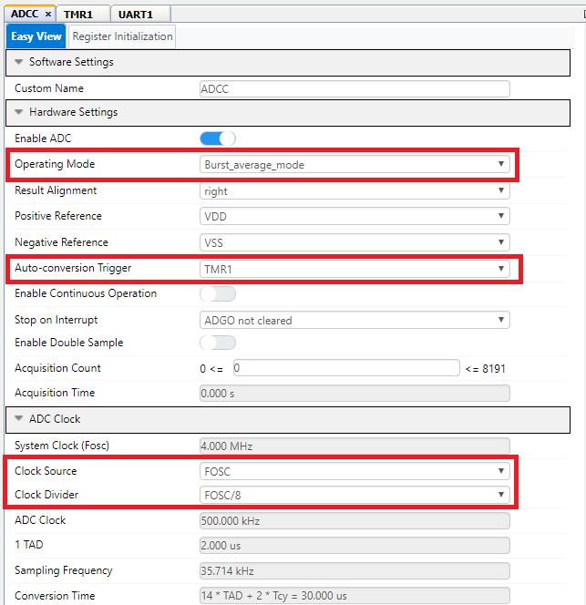
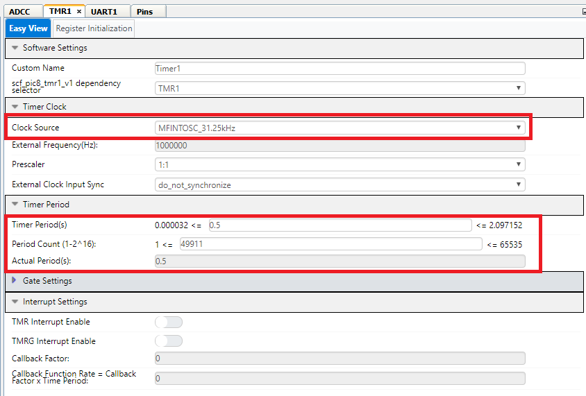
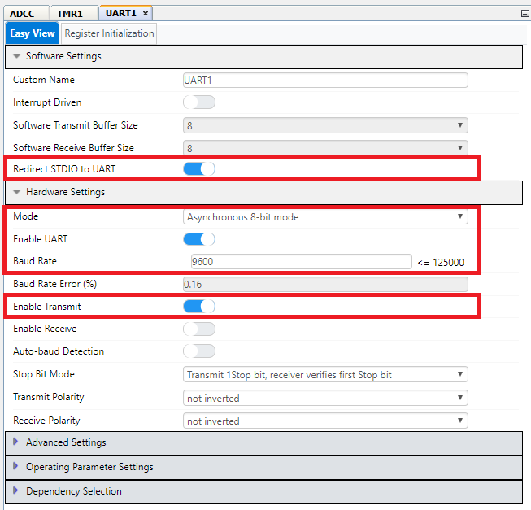

<a href="https://www.microchip.com" rel="nofollow"></a>


## Objective:
The "pic18f57q43-adc-periodic-sampling-mplab-mcc" project demonstrates how to use the MPLAB Code Configurator (MCC) to configure a Timer to automatically trigger the Analog-to-Digital Converter (ADC) to periodically sample an analog channel. Additionally MCC was used to configure the UART module so that the ADC conversion results could be printed via serial port to a PC using the Virtual Communication Port of the Q43 Nano Development Board.

## Software Used:
  - [MPLAB® X IDE 5.45](http://www.microchip.com/mplab/mplab-x-ide) or newer
  - [MPLAB® XC8 2.31 Compiler](microchip.com/mplab/compilers) or newer
  - [MPLAB® Code Configurator (MCC) 4.1.0](microchip.com/mplab/mplab-code-configurator) or newer
  - [MPLAB® Melody Library 1.37.25](https://www.microchip.com/en-us/development-tools-tools-and-software/embedded-software-center/mplab-code-configurator) or newer
  - [Microchip PIC18F-Q Series Device Support (1.11.185)](packs.download.microchip.com/) or newer

## Hardware Used:
  - [PIC18F57Q43 Curiosity Nano Board](https://www.microchip.com/developmenttools/ProductDetails/DM164150)
  - [10kΩ Potentiometer](https://www.digikey.com/en/products/detail/bourns-inc/3386P-1-103TLF/1232547)
  - Misc. Jumper Wires & Breadboard for connecting Potentiometer to Q43 Nano Board

## Demo Configuration:
The PIC18F57Q43 Curiosity Nano Development Board was selected as the development platform for this code example in conjunction with a 10kΩ potentiometer. A serial interface between the microcontroller and PC was established using the Virtual Communication Port included onto the Q43 Nano Development Board. The Q43 Nano Development Board was placed onto a breadboard and connected to a 10kΩ potentiometer using jumper wires as shown in the figure below. The purple jumper wires were used to connect VDD and GND to the corresponding pins of the potentiometer, and the yellow jumper wire was used to connect the potentiometer output to the configured analog input pin RC2 (POT).  


## Curiosity LPC Project Setup:
The following image shows the complete project setup:

</a>

## Analog-to-Digital Converter with Computation (ADCC) Module:
The ADCC was used in this code example to periodically measure the analog channel RC2 (POT) which was connected to a 10kΩ potentiometer. The ADCC was programmed to use Timer1 as an auto-conversion trigger in order to core-independently perform a conversion every 500ms. Additionally, the computation feature of the ADCC was utilized in this example to perform a burst average conversion core independently every time the ADC gets triggered. The ADCC was setup in such a way where it takes 32 consecutive conversions and accumulates the results whenever triggered, and then automatically divides the results by 32 by right shifting the accumulated value by 5 to provide the filtered average ADC result. The MPLAB Code Configurator (MCC) was used to setup the ADCC module for this code example as shown below.

</a>

</a>

## Timer 1 (TMR1) Module
The Timer1 module in this example was used as the ADCC auto-conversion trigger source, meaning that every time Timer1 overflows / rolls over the ADC will be triggered in hardware to begin a conversion. The Timer1 clock source selected was MFINTOSC_31.25kHz with no prescaler, and the Timer1 period was configured to be 500ms. By selecting Timer1 as the auto-conversion trigger source in the ADCC MCC Configuration window, no other actions or setup is needed for the Timer1 work with the ADC in this manner.  The MPLAB Code Configurator (MCC) was used to configure the Timer1 module for this code example as shown below.

</a>

## UART1 Module
The UART module was used in this example to display the ADCC results (burst average value) every time a conversion has completed. The Virtual Communication Port TX and RX pins are connected to RF0 and RF1 pins of the Q43 respectively. UART1 was selected for this example and the TX/RX pins were assigned to correspond and connect to the TX/RX pins of the Virtual Communication Port. The UART was configured to operate at 9600 baud and UART transmission was enabled. Additionally, the "Redirect STDIO to UART" checkbox in MCC was enabled so that "printf" statements could be used to display the ADC results. The MPLAB Code Configurator (MCC) was used to configure the UART module for this code example as shown below.

</a>

## Demo Operation
In this code example MCC was used to configure and initialize all of the peripherals used. Once the peripheral drivers were generated, the only other tasks required to finish initializing the project were to program the ADC Positive Channel that is going to be measured and start Timer1 so that ADC auto-conversions can begin. The code snippet below shows the entire main.c application code used for this project, demonstrating how core independent peripherals can be configured to operate in the background with minimal software intervention.

```c
  int main(void) {
    SYSTEM_Initialize();
    ADPCH = POT; // Set ADC Positive Channel to POT (RC2);
    Timer1_Start(); // Start Timer1 (ADC AutoConversion Trigger);

    while (1) {
          // Timer1 Overflow will trigger ADC conversion by setting ADGO in hardware;
          while (ADCON0bits.ADGO); // Wait here while ADC conversion and calculation is in progress;
          printf("ADC Result %d \r\n", ADCC_GetFilterValue());
          while (!ADCON0bits.ADGO); // Wait here until Timer1 triggers ADGO again;

      }
  }
```
## Code Example Results

</a>
